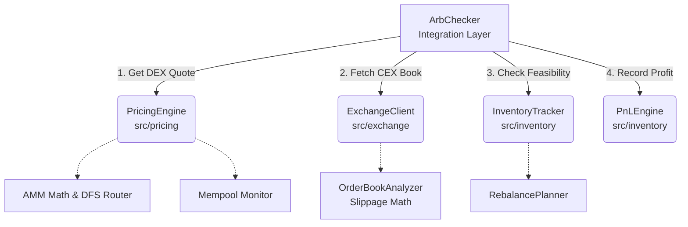

# 🥜 Peanut Trade Quant Internship - CEX/DEX Arbitrage Bot

Welcome to the Peanut Trade Quant Internship (Weeks 1-3) repository. This project is a deterministic, highly reliable CEX-DEX crypto arbitrage bot bridging EVM-compatible DEXs (Uniswap V2/V3) with Centralized Exchanges (Binance Testnet via CCXT).

---

## 🏗️ Architecture & Flow

Our execution and accounting pipeline orchestrates opportunities across both centralized and decentralized venues. The `ArbChecker` serves as the central integration layer:



---

## 🛡️ Key Principles & Features

- **NO FLOATS POLICY**: We strictly use `decimal.Decimal` for all financial mathematics. Floats lose precision; exact deterministic math is required for accounting, slippage calculation, and fee estimation.
- **Robust RPC Clients**: Built-in RPC rotation, deterministic canonical serialization, and extensive network-layer error handling.
- **Strict Execution Guards**: Opportunities are only executed if strict pre-flight checks (`can_execute`) pass against the multi-venue `InventoryTracker`.
- **Advanced Orderbook Math**: Implemented `walk_the_book` logic to calculate true effective spreads and slippage based on actual requested size, not just top-of-book quotes.

---

## 📅 Development Progression

### Week 1: Core & Chain
- EVM wallet management with strict isolation (private keys never leak to logs).
- Deterministic canonical JSON serialization.
- Base primitive types (`TokenAmount`, `Address`) with mathematically safe operations.

### Week 2: Pricing Engine
- Exact integer AMM math matching Uniswap V2 smart contracts.
- Depth-First Search (DFS) `RouteFinder` for detecting cyclic and cross-pool arbitrage routes.
- WSS Mempool monitoring and Anvil-based transaction simulation.

### Week 3: Execution & Accounting
- Unified CEX interface via `ccxt` (Binance testnet).
- `OrderBookAnalyzer` for depth, imbalance, and execution price simulation.
- `InventoryTracker` and `RebalancePlanner` for portfolio state and skew management.
- `PnLEngine` for accurate basis-point (bps) profit calculation.

---

## 🚀 Quick Start

### 1. Clone the repository
```bash
git clone [https://github.com/PEANUT_TRADE_GITHUB/peanut-internship-2026.git](https://github.com/PEANUT_TRADE_GITHUB/peanut-internship-2026.git)
cd peanut-internship-2026
```

### 2. Setup environment variables
```bash
cp .env.example .env
# Edit .env and add your Alchemy RPC, Private Key, and Binance Testnet keys.
```

### 3. Install dependencies
```bash
make install
```

### 4. Run tests
```bash
make test
# OR to run linters, formatters, and tests together:
make check
```

---

## 💻 CLI Usage (Demo)

We provide a built-in Makefile target to run the end-to-end integration demo. This simulates the `ArbChecker` fetching quotes, order books, and verifying inventory logic.

```bash
make demo-arb
# Equivalent to: python -m src.integration.arb_checker ETH/USDT --size 2.0
```

### Sample Output

```text
═══════════════════════════════════════════
  ARB CHECK: ETH/USDT (size: 2.0 ETH)
═══════════════════════════════════════════

Prices:
  Uniswap V2:      $2,007.21 (buy 2.0 ETH)
  Binance bid:      $2,015.00

Gap: $7.79 (38.8 bps)

Costs:
  DEX fee:           30.0 bps
  DEX price impact:   1.2 bps
  CEX fee:           10.0 bps
  CEX slippage:       0.4 bps
  Gas:               $5.00 (2.5 bps)
  ────────────────────────
  Total costs:       44.1 bps

Net PnL estimate: -5.3 bps ❌ NOT PROFITABLE

Inventory:
  Wallet USDT:  15,000 (need ~4,015) ✅
  Binance ETH:   8.0   (need 2.0)    ✅

Verdict: SKIP — costs exceed gap
═══════════════════════════════════════════
```
